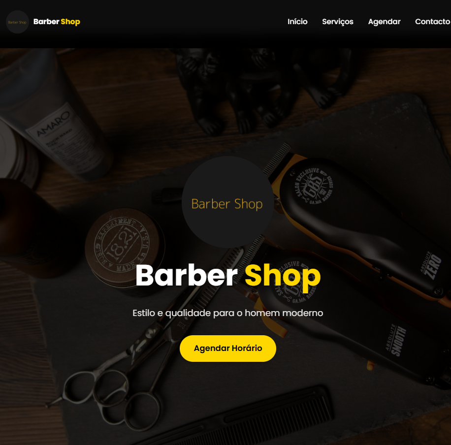

# Barber Shop

Website de agendamento para barbearia, desenvolvido com React + Vite. Permite que clientes visualizem serviços, preços, galeria e agendem horários diretamente pelo site com integração ao Google Calendar.

**Demo:** [barbearia-cruz.vercel.app](https://barbearia-cruz.vercel.app)



---

## Funcionalidades

- Apresentação de serviços e tabela de preços
- Galeria de trabalhos
- Agendamento online com seleção de barbeiro, data e horário
- Integração com Google Calendar para verificação de disponibilidade e criação de eventos
- Secção de contacto com mapa integrado
- Layout totalmente responsivo (mobile-first)

## Tecnologias

- **React 19** + **Vite** (rolldown-vite)
- **Google Calendar API** via `googleapis`
- **Express** — servidor backend para autenticação OAuth
- **Font Awesome** — ícones
- **Google Fonts** (Poppins)

## Estrutura

```
src/
├── components/       # Header, Hero, Services, Prices, Hours, Gallery, Schedule, Contact, Footer
├── config/
│   ├── calendarConfig.js   # Configuração dos barbeiros, horários e serviços
│   └── servicePrices.jsx
└── services/
    └── googleCalendarService.js  # Integração com Google Calendar API
public/
└── assets/           # Imagens dos barbeiros e logo
```

## Instalação

```bash
npm install
```

### Variáveis de ambiente

Cria um ficheiro `.env` na raiz com:

```env
VITE_GOOGLE_API_KEY=your_google_api_key
```

### Desenvolvimento

```bash
# Frontend
npm run dev

# Backend (agendamento)
npm run start-backend
```

### Build

```bash
npm run build
```

---

Desenvolvido por [Talles Guerra](https://www.linkedin.com/in/talles-guerra/)
